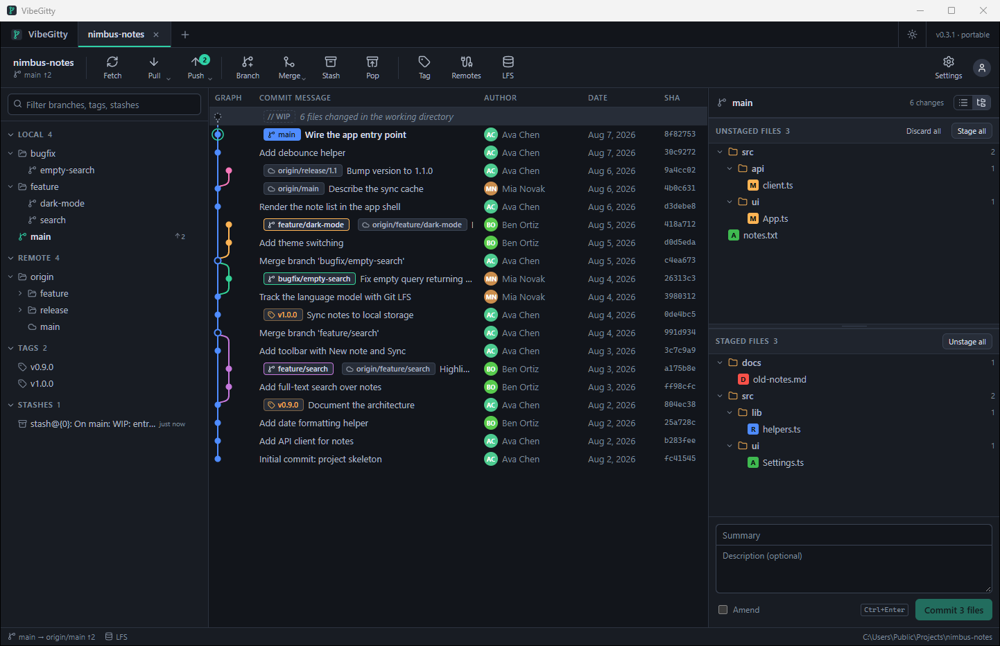

# VibeGitty

A cross-platform Git desktop client (Windows, macOS, Linux) built with [Tauri 2](https://tauri.app),
Rust and React. The UI follows the GitKraken layout: repository tabs, a toolbar
(Fetch / Pull / Push / Branch / Merge / Stash / Pop / Tag / Remotes / LFS), a branch
tree on the left, the commit graph in the middle and the working-directory /
commit-detail panel on the right.

Everything git-related is **built in**: libgit2 is statically vendored, Git LFS is
implemented in-process, SSH uses libssh2, HTTPS uses rustls. No external `git`,
`git-lfs` or `ssh` executable is needed.

Source: <https://github.com/jiapw/vibegitty>



## Features

- Open, clone and initialize repositories; several repositories open at once (tabs),
  an *Open recent* list in the "+" menu (entries can be removed), and the clone dialog
  remembers the last parent folder.
- Commit graph over all branches, remotes and tags with lane layout, a WIP row, HEAD
  marker, branch / remote / tag labels pointing at their commits, virtualized for large
  histories ("Load more" paging).
- Working directory: stage / unstage / discard per file, per selection (Ctrl/Shift
  click, Ctrl+A), per folder or all; flat list or folder tree (single-child folder
  chains are compacted); unstaged and staged lists in a resizable vertical split.
  Right-click untracked files or folders to add them, a parent folder or their
  extension to `.gitignore`. Commit with a single-line summary + description, amend,
  Ctrl+Enter.
- Diff view (unstaged, staged, conflicts, per commit): unified hunks or a side-by-side
  view of the whole file, soft wrap on/off, character-level highlighting inside changed
  lines, change marks on the scrollbar, previous / next change buttons, and the view
  opens at the first change. In side-by-side mode without wrapping each side clips and
  scrolls long lines on its own while both sides stay aligned and in sync.
- Branches: create, checkout, checkout remote branch (creates a tracking branch),
  rename, delete (with force fallback), set upstream, ahead/behind counts.
- Fetch (with prune), pull (merge or fast-forward only), push (set upstream, force),
  delete remote branches, push tags, manage remotes.
- Merge with conflict handling: conflicted files listed, take ours / theirs or edit and
  mark resolved, commit the merge, or abort. Cherry-pick, revert, reset (soft / mixed
  / hard), tags (lightweight and annotated), stashes (save / apply / pop / drop).
- Accounts (see [Sign-in setup](#sign-in-setup)):
  - **GitHub**: sign in with the browser (OAuth web flow, like GitKraken), device flow
    as a fallback, or a personal access token; GitHub Enterprise supported.
  - **GitLab** (gitlab.com or self-hosted): OAuth 2.0 with PKCE + loopback redirect, or
    a personal access token.
  - **Gitea / Forgejo**: OAuth (PKCE) or access token.
  - **Bitbucket**: app password; any other git server with username + password/token.
  - Tokens live in the OS keychain (Credential Manager / Keychain / Secret Service).
    Accounts are used for HTTPS push/pull/fetch, LFS transfers and for listing your
    repositories in the clone dialog. A rejected token is reported clearly with a
    *Sign in again* shortcut; *Sign in again* on an account reuses the current token when
    it still works.
- SSH remotes use ssh-agent (Pageant / OpenSSH agent) or `~/.ssh/id_ed25519`,
  `id_ecdsa`, `id_rsa`.
- **Git LFS built in**: `.gitattributes` patterns, pointer files, the local object
  store (`.git/lfs/objects`, compatible with git-lfs), the batch API and transfers.
  Staging an LFS-tracked file stores its content and commits a pointer; checkout /
  pull / clone download and restore content; push uploads the objects first (like the
  git-lfs pre-push hook). `git-lfs-authenticate` over SSH is supported. Large files
  in the changes panel get a size warning and a one-click "Track with LFS".
- Dark, light or system theme; panel widths, list/tree and diff toggles, the split
  ratio and the theme are remembered between launches.
- Live refresh: a filesystem watcher picks up changes made by editors or other tools.

## Project layout

```
src/                 React + TypeScript frontend (Vite)
  components/        TabBar, Toolbar, LeftPanel, CommitGraph, RightPanel, DiffView, modals...
  lib/graph.ts       commit graph lane layout
  lib/actions.ts     UI actions (fetch, pull, push, checkout, stage, commit, LFS...)
  lib/menus.tsx      context menus
  lib/theme.ts       dark / light / system theme
  store/             zustand stores (repos, config, ui preferences)
  devMock.ts         fake backend so `npm run dev` works in a plain browser
src-tauri/src/
  git/               libgit2 engine: log, status, staging, commit, branch, merge, diff, remote...
  lfs/               Git LFS: attributes, pointers, store, smudge/clean, batch transfers, ssh auth
  auth/              GitHub web + device flows, PKCE loopback flow, provider REST APIs
  config.rs          settings, portable mode, built-in OAuth client id / secret
  secrets.rs         keychain / file token storage
  commands.rs        Tauri command layer
  watcher.rs         filesystem watcher
src-tauri/build.rs   compiles the optional GitHub client secret into the binary
src-tauri/tests/     integration tests for the git engine and LFS (libgit2 only)
```

## Building

Prerequisites: Rust (stable), Node.js 18+, and the platform requirements of Tauri 2
(<https://tauri.app/start/prerequisites/>).

- Windows: Visual Studio C++ build tools, WebView2 (bundled with Windows 10/11).
- macOS: Xcode command line tools. OpenSSL is needed for libssh2; either
  `brew install openssl@3` or build with `--features vendored-openssl`.
- Linux (Debian/Ubuntu):
  `sudo apt install libwebkit2gtk-4.1-dev build-essential curl wget file libxdo-dev libssl-dev libayatana-appindicator3-dev librsvg2-dev libdbus-1-dev pkg-config`
  (`libdbus-1-dev` is used by the keychain integration; `libssl-dev` by libssh2. Use
  `--features vendored-openssl` to build OpenSSL from source instead.)

```bash
npm install
npm run dev                  # UI only in a browser, backed by src/devMock.ts (fake repo)
npm run tauri dev            # run in development mode
npm run tauri build          # produce installers/bundles for the current platform
npm run tauri build -- --no-bundle   # just the executable
# e.g. with vendored OpenSSL on Linux/macOS:
npm run tauri build -- --features vendored-openssl
```

The version is set in three places: `package.json`, `src-tauri/tauri.conf.json` and
`src-tauri/Cargo.toml`. It is shown at the top right of the window and in Settings.

### Portable (single-file) Windows build

`src-tauri/target/release/vibegitty.exe` produced by `npm run tauri build` is
self-contained (frontend assets, libgit2, libssh2, LFS and TLS are all compiled in);
it only needs the WebView2 runtime that ships with Windows 10/11. Portable releases are
kept in `release/` as `VibeGitty-<version>-x64-portable.exe`.

To run it as a portable app, put a `VibeGittyData` folder (or an empty `portable.txt`
file) next to the exe: settings and tokens are then stored there instead of
`%APPDATA%\VibeGitty` and the Windows Credential Manager. Settings from the app's
earlier name (GitConn) are migrated automatically on first start.

### Tests

```bash
cd src-tauri
cargo test --test ops
```

The tests build real repositories with libgit2 (no git binary) and cover status,
staging, commits, branches, merges and conflicts, stashes, remotes over a local bare
repository, and LFS staging / smudging / push preparation.

## Sign-in setup

### GitHub

Two OAuth flows are supported for github.com and GitHub Enterprise:

- **Browser sign-in** (default): the app opens GitHub's authorization page in your
  browser; once you approve, GitHub sends the browser back to
  `http://127.0.0.1:47831/callback`, the app exchanges the code for a token and comes
  back to the front. If you have authorized the app before, GitHub skips the approval
  page and the callback page appears right away. GitHub requires the OAuth App's
  *client secret* for this flow, so it is only used when one is compiled in (see
  below).
- **Device flow**: used automatically when no client secret is compiled in. A one-time
  code is shown in the app and confirmed on github.com; the OAuth App must have
  *Device Flow* enabled.

A client id for github.com is built into the app (`BUILTIN_GITHUB_CLIENT_ID` in
`src-tauri/src/config.rs`, overridable with the `VIBEGITTY_GITHUB_CLIENT_ID` environment
variable at build time). The matching client secret is **not** in the sources; every
build that should offer browser sign-in needs it supplied as described next.

#### Getting the client secret

1. Sign in to GitHub and open <https://github.com/settings/developers> → **OAuth Apps**.
2. Open the app whose client id is built in (or create one with **New OAuth App**:
   any name and homepage, *Authorization callback URL*
   `http://127.0.0.1:47831/callback` or `http://127.0.0.1/callback`, and *Enable Device
   Flow* ticked so the fallback works). If you created a new app, build with
   `VIBEGITTY_GITHUB_CLIENT_ID` set to its client id.
3. In the **Client secrets** section click **Generate a new client secret** (GitHub may
   ask for your password or 2FA). The 40-character hex string is shown **only once**;
   copy it immediately. If you lose it, generate another one and delete the old one;
   tokens already issued to users keep working.

#### Where to put it

Save the secret as a single line in `src-tauri/github-client-secret.txt` (next to
`Cargo.toml`): only the 40 characters, no quotes, spaces or extra lines. The file is
listed in `.gitignore`, so it never enters the repository. Alternatively set the
`VIBEGITTY_GITHUB_CLIENT_SECRET` environment variable for the build; it takes precedence
over the file.

`src-tauri/build.rs` reads either source and compiles the value into the binary, so the
secret is present in the shipped executable (as in GitHub Desktop and other native
clients). Anyone extracting it can only impersonate the app on GitHub's authorization
page; it grants no access to accounts.

#### Building a release with browser sign-in

```bash
# 1. put the secret in place: one line, nothing else (or export VIBEGITTY_GITHUB_CLIENT_SECRET)
printf '%s' '<the 40-character client secret>' > src-tauri/github-client-secret.txt

# 2. build the executable
npm install
npm run tauri build -- --no-bundle

# 3. Windows portable exe: copy it under the release name; put a VibeGittyData folder
#    next to it if settings should live beside the exe
cp src-tauri/target/release/vibegitty.exe release/VibeGitty-<version>-x64-portable.exe
```

The same commands with `npm run tauri build` (no `--no-bundle`) produce installers.
Cargo re-runs the build script whenever the secret file or the environment variable
changes, so switching secrets does not need a clean build. To check a build, open
**Accounts → Add account** with GitHub selected: with the secret compiled in the
dialog says the sign-in completes in the browser; without it, it describes the device
flow.

GitHub Enterprise servers use their own OAuth App: enter its client id, and optionally
the client secret, in the sign-in dialog; both are remembered in Settings. A personal
access token with the `repo` scope works everywhere as an alternative.

### GitLab, Gitea / Forgejo

- **GitLab**: create an application (User Settings → Applications) with *Confidential*
  unchecked, redirect URI `http://127.0.0.1:47831/callback` and scopes `api read_user`.
  PKCE is used; no secret is needed.
- **Gitea / Forgejo**: create an OAuth2 application (public client) with the same
  redirect URI.

## Notes on the git engine

- Authentication for HTTPS remotes: the matching account token is used first; if none
  matches, an existing git credential helper (if any is configured) is tried. SSH host
  keys are accepted on first use.
- Pull is fetch + merge (or fast-forward only). Rebase is not implemented yet.
- Aborting a merge / cherry-pick / revert resets the working tree to HEAD.
- Diffs have no line limit; the side-by-side view virtualizes its rows, so file
  length does not matter. Files over 8 MB are not diffed as text; LFS files show their
  pointer.
